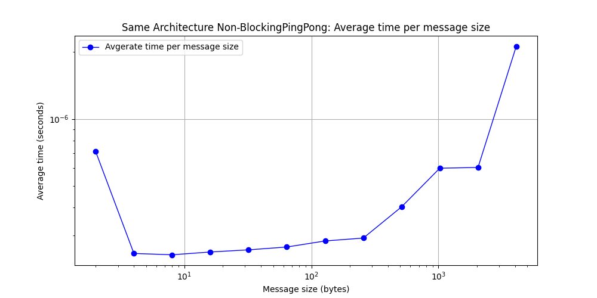
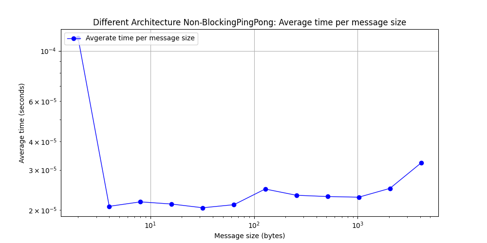

## Part 1: Blocking Ping-Pong (TODO: Jacob and Jared)

Your task is to implement the ping-pong problem using MPI in C or C++ and analyze the behavior and performance of your code. Specifically, you should:

1. Implement the ping-pong problem using MPI in C or C++. Use blocking `MPI_Send()` and `MPI_Recv()` calls. You should define the number of iterations and the size of the message to be exchanged.
    Done!
2. Measure the time taken to complete the ping-pong exchange for different message sizes. You should use the `MPI_Wtime()` function to obtain the time before and after the exchange and calculate the elapsed time. Vary the message size from 2 bytes to 4 kilobytes in powers of 2 (i.e., 2 bytes, 4 bytes, 8 bytes,..., 2048 bytes, 4096 bytes). For each message size, perform 100 iterations of the ping-pong to build up statistical significance.
    Done!
3. Record the total amount of data sent and received during the ping-pong exchange for each configuration.
    TODO: Jacob?.

    The total message size (send and receive) in bytes is equal to the size of 1 message in bytes, multiplied by 2 since it's sent and received twice (once by each process), and then multiplied by 100 since our total message size includes the message sizes for all 100 iterations.
    
    | Message size (bytes) | Total message size (send and receive) in bytes |
    |-----------------|-----------------|
    | 2 | 400 |
    | 4 | 800 |
    | 8 | 1600 |
    | 16 | 3200 |
    | 32 | 6400 |
    | 64 | 12800 |
    | 128 | 25600 |
    | 256 | 51200 |
    | 512 | 102400 |
    | 1024 | 204800 |
    | 2048 | 409600 |
    | 4096 | 819200 |
   
4. Repeat steps 2 and 3 but ensure that the 2 processes that are communicating reside on different physical hardware nodes on HPCC.
5. Plot the average communication time of a single exchange (send and receive) as a function of message size for the two cases. Using this plot, estimate the _latency_ and _bandwidth_ for each case. Are they different? Explain your results.

Above are our plots that show the average communication time of a single exchange (send and recieve) as a function of message size for the case of blocking ping pong on the same architecture and the case of blocking ping pong on different architectures. Based on these plots, we can estimate the latency (the delay between the processor issuing a request for a memory item and the item actually arriving) and the bandwidth (the rate at which data arrives at its destination after the initial latency is overcome) for each of the two cases described in the previous sentence.

In order to find the latency for each case, we just need to look at each point on our plots to determine the average latency for each case at each given message size. So, for the case of blocking ping pong on the same architecture, the latency typically varies between 1x10-6 and 6x10-6 seconds, while the case of blocking ping pong on different architectures is more consistently located around 5x10-5 seconds and 7x10-5 seconds latencies. However, looking at both graphs, we can see that the latency for the initial message size of 2 bytes is much higher than what would be expected and stands as an outlier for both blocking ping pong on the same and different architectures, and we believe this abnormality is due to high up-front cost of the program that is creating delayed and abnormally large latency times in the 2 byte message dataset.

As for the bandwidth, we can look at the slope of the lines between our latency points on our graph to estimate the bandwidth and see if it increases and by how much it increases as the message size gets larger. Flat lines early in the plots for both cases indicate that for small message sizes (that aren't message size = 2 bytes for reasons previously described), the bandwidth doesn't relatively change with the latency since we don't see an increase in latency as the message size goes up, and this typically means that the initial latency hasn't been overcome by the bandwidth yet. However, once we get to message sizes of 64 bytes and above in both plots, we start to see an exponential increase in latency values, with latency going from 1x10-6 seconds at 64 bytes to 6x10-6 seconds at 4096 bytes for the same architecture case and 5x10-5 seconds at 64 bytes to 7x10-5 seconds at 4096 bytes for the different architectures case. Given these estimations, this means that the average bandwidth for the same architecture case went from 64/(1x10-6) = 64,000,000 bytes/second at 64 bytes to 682,666,666.7 bytes/second at 4096 bytes and the average bandwidth for the different architectures case went from 1,280,000 bytes/second at 64 bytes to 58,514,285.71 bytes/second at 4096 bytes.

So, the latency and bandwidth for both cases increases as the message size gets larger, but the case of different architectures has much larger latency and smaller bandwidth values than the case of blocking ping pong being ran on the same architecture. This makes sense, as processes running on the same architecture will be closer together and therefore will be able to communicate more efficiently than processes running on different architectures.

6. Analyze and discuss your results. Explain the behavior of the resulting curves.

As we touched upon in the previous question, our resulting plots for blocking ping pong make sense. For both the case of blocking ping pong on the same architecture and the case of blocking ping pong on different architectures, we see an expected increase in latency and bandwidth as the message sizes increase since larger messages will take longer to send due to the fact that they have more data to send, which will also increase bandwidth as the hardware tries to send the larger messages more quickly. However, this increase in bandwidth is still dependent on hardware limitations, which is why the bandwidth doesn't always increase to a point where latency is the same regardless of the message size. It also makes sense that the case of blocking ping pong on different architectures has lower bandwidth and higher latency than blocking ping pong on the same architecture, as the increased physical distance between nodes that processes are running on will lead to increased time to send and receive messages (latency) and cause lower bandwidth.

The one outlier that appears in both plots is a large latency value for the initial message size (message size = 2 bytes), followed by a steep bandwidth drop off before we see expected latency and bandwidth values for all messages sizes from 4 bytes onward. We have chalked this outlier up to up-front costs of the program which are causing the latency values for message sizes of 2 bytes to be inflated and not representative of the overall trend we see in our plots.

## Part 2: Non-block Ping-Pong (TODO: Jared and Jacob)

Repeat Part 1 using non-blocking MPI communication, i.e., using `MPI_Isend()` and `MPI_Irecv()`. You will need to include explicit process synchronization using, e.g., `MPI_Wait()` calls. Compare the results to the blocking case.

## Part 3: MPI Ring Shift (TODO: Berk and Cheng)

1. Implement the MPI ring shift in C or C++ for an arbitrary number of processes in the ring and arbitrary message size (i.e., number of elements per process). In your implementation, use `MPI_Sendrecv()` instead of separate `MPI_Send()` and `MPI_Recv()` calls.
2. As in Parts 1 and 2, vary the message size from 2 bytes to 4 kb, in powers of 2. Also vary the number of processes used from 2 to `N`, in powers of 2, where `N` is sufficiently large that rank 0 and rank `N-1` are guaranteed to reside on separate nodes (`N` will depend on which cluster you are using on HPCC).
3. Compute the bandwidth and latency, as above. Plot the bandwidth as a function of message size. Include separate lines for each number of processes used.
4. Analyze and discuss your results. Explain the behavior of the resulting curves.

## Part 4: Non-blocking MPI Ring Shift (TODO: Berk and Cheng)

Repeat Part 3 but using non-blocking communication via `MPI_Isendrecv()`. Compare the results to the blocking case.
