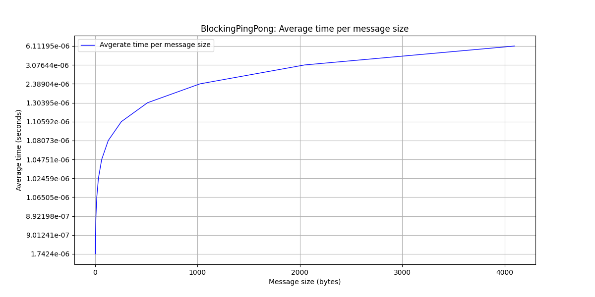
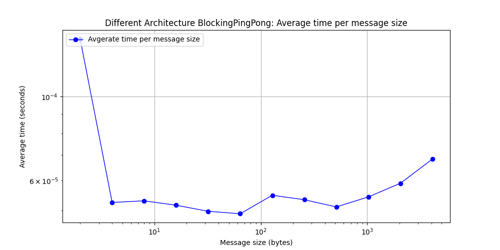

## Part 1: Blocking Ping-Pong (TODO: Jacob and Jared)

Your task is to implement the ping-pong problem using MPI in C or C++ and analyze the behavior and performance of your code. Specifically, you should:

1. Implement the ping-pong problem using MPI in C or C++. Use blocking `MPI_Send()` and `MPI_Recv()` calls. You should define the number of iterations and the size of the message to be exchanged.
    Done!
2. Measure the time taken to complete the ping-pong exchange for different message sizes. You should use the `MPI_Wtime()` function to obtain the time before and after the exchange and calculate the elapsed time. Vary the message size from 2 bytes to 4 kilobytes in powers of 2 (i.e., 2 bytes, 4 bytes, 8 bytes,..., 2048 bytes, 4096 bytes). For each message size, perform 100 iterations of the ping-pong to build up statistical significance.
    Done!
3. Record the total amount of data sent and received during the ping-pong exchange for each configuration.
    TODO: Jacob?.
4. Repeat steps 2 and 3 but ensure that the 2 processes that are communicating reside on different physical hardware nodes on HPCC.
5. Plot the average communication time of a single exchange (send and receive) as a function of message size for the two cases. Using this plot, estimate the _latency_ and _bandwidth_ for each case. Are they different? Explain your results.

TODO: Calculate Latency and Bandwidth -> Jacob?

| Message size (bytes) | Total message size (send and receive) in bytes |
|-----------------|-----------------|
| 2 | 400 |
| 4 | 800 |
| 8 | 1600 |
| 16 | 3200 |
| 32 | 6400 |
| 64 | 12800 |
| 128 | 25600 |
| 256 | 51200 |
| 512 | 102400 |
| 1024 | 204800 |
| 2048 | 409600 |
| 4096 | 819200 |

6. Analyze and discuss your results. Explain the behavior of the resulting curves.

TODO: Jacob/Jared?

## Part 2: Non-block Ping-Pong (TODO: Jared and Jacob)

Repeat Part 1 using non-blocking MPI communication, i.e., using `MPI_Isend()` and `MPI_Irecv()`. You will need to include explicit process synchronization using, e.g., `MPI_Wait()` calls. Compare the results to the blocking case.

## Part 3: MPI Ring Shift (TODO: Berk and Cheng)

1. Implement the MPI ring shift in C or C++ for an arbitrary number of processes in the ring and arbitrary message size (i.e., number of elements per process). In your implementation, use `MPI_Sendrecv()` instead of separate `MPI_Send()` and `MPI_Recv()` calls.
2. As in Parts 1 and 2, vary the message size from 2 bytes to 4 kb, in powers of 2. Also vary the number of processes used from 2 to `N`, in powers of 2, where `N` is sufficiently large that rank 0 and rank `N-1` are guaranteed to reside on separate nodes (`N` will depend on which cluster you are using on HPCC).
3. Compute the bandwidth and latency, as above. Plot the bandwidth as a function of message size. Include separate lines for each number of processes used.
4. Analyze and discuss your results. Explain the behavior of the resulting curves.

## Part 4: Non-blocking MPI Ring Shift (TODO: Berk and Cheng)

Repeat Part 3 but using non-blocking communication via `MPI_Isendrecv()`. Compare the results to the blocking case.
