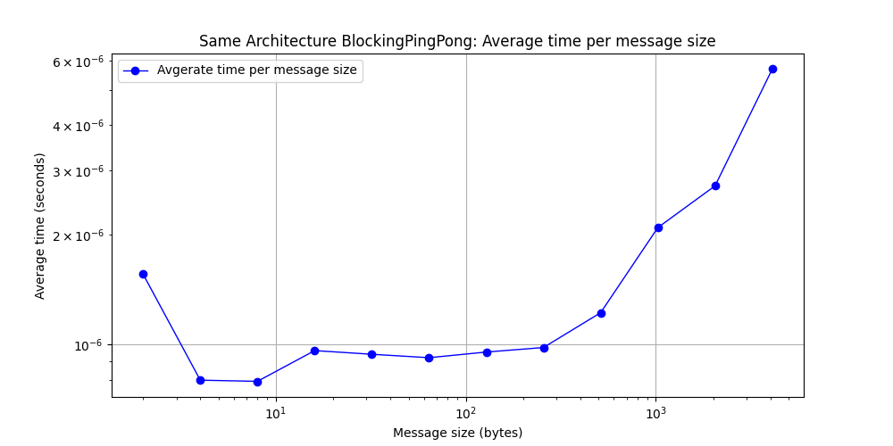
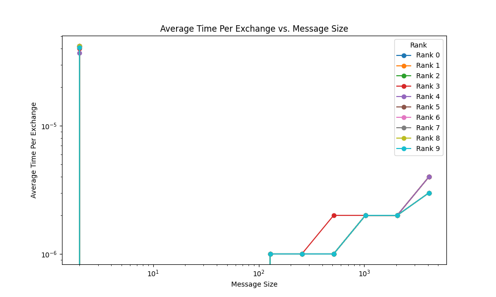
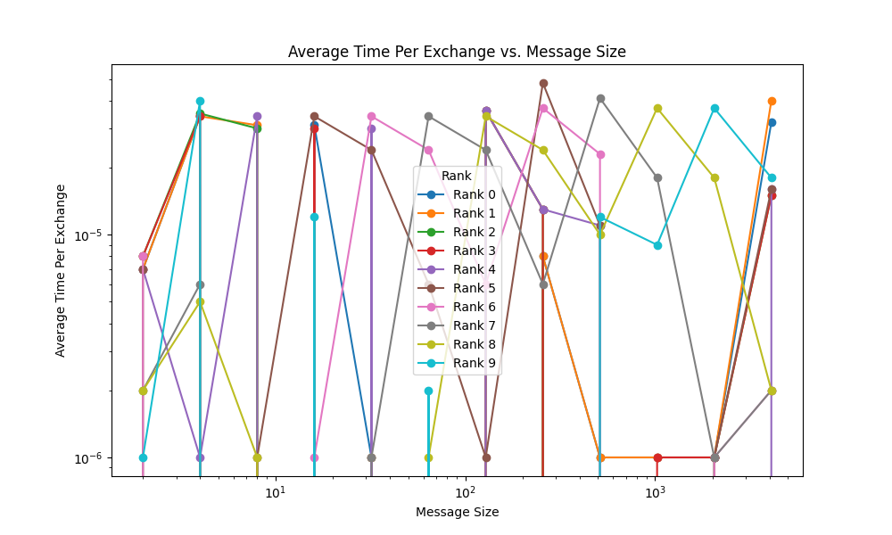

## Part 1: Blocking Ping-Pong

Your task is to implement the ping-pong problem using MPI in C or C++ and analyze the behavior and performance of your code. Specifically, you should:

1. Implement the ping-pong problem using MPI in C or C++. Use blocking `MPI_Send()` and `MPI_Recv()` calls. You should define the number of iterations and the size of the message to be exchanged.
    Done!
2. Measure the time taken to complete the ping-pong exchange for different message sizes. You should use the `MPI_Wtime()` function to obtain the time before and after the exchange and calculate the elapsed time. Vary the message size from 2 bytes to 4 kilobytes in powers of 2 (i.e., 2 bytes, 4 bytes, 8 bytes,..., 2048 bytes, 4096 bytes). For each message size, perform 100 iterations of the ping-pong to build up statistical significance.
    Done!
3. Record the total amount of data sent and received during the ping-pong exchange for each configuration.
    
The total message size (send and receive) in bytes is equal to the size of 1 message in bytes, multiplied by 2 since it's sent and received twice (once by each process), and then multiplied by 100 since our total message size includes the message sizes for all 100 iterations. This message size is found below, and is the same regardless of if the process is run on the same node or on different nodes within the HPCC.
    
| Message size (bytes) | Total message size (send and receive) in bytes |
|-----------------|-----------------|
| 2 | 400 |
| 4 | 800 |
| 8 | 1600 |
| 16 | 3200 |
| 32 | 6400 |
| 64 | 12800 |
| 128 | 25600 |
| 256 | 51200 |
| 512 | 102400 |
| 1024 | 204800 |
| 2048 | 409600 |
| 4096 | 819200 |
   
4. Repeat steps 2 and 3 but ensure that the 2 processes that are communicating reside on different physical hardware nodes on HPCC.

Part 1 Question 2 was repeated and plotted in the different nodes plot displayed in Part 1 Question 5. Part 1 Question 3 is the same for both blocking ping pong on the same node and blocking ping pong on different nodes because the size of the messages we are sending and receiving are a constant in our code and are not dependent on whether or not the code is ran on the same node or different nodes. For that reason, please refer to Part 1 Question 3 for the repeated step on a different physical hardware node.
   
5. Plot the average communication time of a single exchange (send and receive) as a function of message size for the two cases. Using this plot, estimate the _latency_ and _bandwidth_ for each case. Are they different? Explain your results.

Above are our plots that show the average communication time of a single exchange (send and recieve) as a function of message size for the case of blocking ping pong on the same node and the case of blocking ping pong on different nodes. Based on these plots, we can estimate the latency (the delay between the processor issuing a request for a memory item and the item actually arriving) and the bandwidth (the rate at which data arrives at its destination after the initial latency is overcome) for each of the two cases described in the previous sentence.

In order to find the latency for each case, we just need to look at each point on our plots to determine the average latency for each case at each given message size. So, for the case of blocking ping pong on the same node, the latency typically varies between 1x10-6 and 6x10-6 seconds, while the case of blocking ping pong on different nodes is more consistently located around 5x10-5 seconds and 7x10-5 seconds latencies. However, looking at both graphs, we can see that the latency for the initial message size of 2 bytes is much higher than what would be expected and stands as an outlier for both blocking ping pong on the same and different nodes, and we believe this abnormality is due to high up-front cost of the program that is creating delayed and abnormally large latency times in the 2 byte message dataset.

As for the bandwidth, we can look at the slope of the lines between our latency points on our graph to estimate the bandwidth and see if it increases and by how much it increases as the message size gets larger. Flat lines early in the plots for both cases indicate that for small message sizes (that aren't message size = 2 bytes for reasons previously described), the bandwidth doesn't relatively change with the latency since we don't see an increase in latency as the message size goes up, and this typically means that the initial latency hasn't been overcome by the bandwidth yet. However, once we get to message sizes of 64 bytes and above in both plots, we start to see an exponential increase in latency values, with latency going from 1x10-6 seconds at 64 bytes to 6x10-6 seconds at 4096 bytes for the same node case and 5x10-5 seconds at 64 bytes to 7x10-5 seconds at 4096 bytes for the different nodes case. Given these estimations, this means that the average bandwidth for the same node case went from 64/(1x10-6) = 64,000,000 bytes/second at 64 bytes to 682,666,666.7 bytes/second at 4096 bytes and the average bandwidth for the different nodes case went from 1,280,000 bytes/second at 64 bytes to 58,514,285.71 bytes/second at 4096 bytes.

So, the latency and bandwidth for both cases increases as the message size gets larger, but the case of different nodes has much larger latency and smaller bandwidth values than the case of blocking ping pong being ran on the same node. This makes sense, as processes running on the same node will be closer together and therefore will be able to communicate more efficiently than processes running on different nodes.

6. Analyze and discuss your results. Explain the behavior of the resulting curves.

As we touched upon in the previous question, our resulting plots for blocking ping pong make sense. For both the case of blocking ping pong on the same node and the case of blocking ping pong on different nodes, we see an expected increase in latency and bandwidth as the message sizes increase since larger messages will take longer to send due to the fact that they have more data to send, which will also increase bandwidth as the hardware tries to send the larger messages more quickly. However, this increase in bandwidth is still dependent on hardware limitations, which is why the bandwidth doesn't always increase to a point where latency is the same regardless of the message size. It also makes sense that the case of blocking ping pong on different nodes has lower bandwidth and higher latency than blocking ping pong on the same node, as the increased physical distance between nodes that processes are running on will lead to increased time to send and receive messages (latency) and cause lower bandwidth.

The one outlier that appears in both plots is a large latency value for the initial message size (message size = 2 bytes), followed by a steep bandwidth drop off before we see expected latency and bandwidth values for all messages sizes from 4 bytes onward. We have chalked this outlier up to up-front costs of the program which are causing the latency values for message sizes of 2 bytes to be inflated and not representative of the overall trend we see in our plots.

## Part 2: Non-block Ping-Pong

Repeat Part 1 using non-blocking MPI communication, i.e., using `MPI_Isend()` and `MPI_Irecv()`. You will need to include explicit process synchronization using, e.g., `MPI_Wait()` calls. Compare the results to the blocking case.

3. Record the total amount of data sent and received during the ping-pong exchange for each configuration.
    
**The total amount of data sent and received during the ping-pong exchange for each configuration does not change regardless of if blocking or non-blocking MPI communication is used. For this reason, the answer to Part 2 Question 3 is the same as the answer to Part 1 Question 3.**

The total message size (send and receive) in bytes is equal to the size of 1 message in bytes, multiplied by 2 since it's sent and received twice (once by each process), and then multiplied by 100 since our total message size includes the message sizes for all 100 iterations. This message size is found below, and is the same regardless of if the process is run on the same node or on different nodes within the HPCC.
    
| Message size (bytes) | Total message size (send and receive) in bytes |
|-----------------|-----------------|
| 2 | 400 |
| 4 | 800 |
| 8 | 1600 |
| 16 | 3200 |
| 32 | 6400 |
| 64 | 12800 |
| 128 | 25600 |
| 256 | 51200 |
| 512 | 102400 |
| 1024 | 204800 |
| 2048 | 409600 |
| 4096 | 819200 |
   
4. Repeat steps 2 and 3 but ensure that the 2 processes that are communicating reside on different physical hardware nodes on HPCC.

Part 2 Question 2 was repeated and plotted in the different nodes plot displayed in Part 2 Question 5. Part 2 Question 3 is the same for both non-blocking ping pong on the same node and non-blocking ping pong on different nodes because the size of the messages we are sending and receiving are a constant in our code and are not dependent on whether or not the code is ran on the same node or different nodes. For that reason, please refer to Part 2 Question 3 for the repeated step on a different physical hardware node.
   
5. Plot the average communication time of a single exchange (send and receive) as a function of message size for the two cases. Using this plot, estimate the _latency_ and _bandwidth_ for each case. Are they different? Explain your results.

Above are our plots that show the average communication time of a single exchange (send and recieve) as a function of message size for the case of non-blocking ping pong on the same node and the case of non-blocking ping pong on different nodes. Based on these plots, we can estimate the latency (the delay between the processor issuing a request for a memory item and the item actually arriving) and the bandwidth (the rate at which data arrives at its destination after the initial latency is overcome) for each of the two cases described in the previous sentence.

In order to find the latency for each case, we just need to look at each point on our plots to determine the average latency for each case at each given message size. So, for the case of non-blocking ping pong on the same node, the latency typically varies between 2x10-7 and 2x10-6 seconds, while the case of non-blocking ping pong on different nodes is more consistently located around 2x10-5 and 3x10-5 seconds latencies. However, looking at both graphs, we can see that the latency for the initial message size of 2 bytes is much higher than what would be expected and stands as an outlier for both non-blocking ping pong on the same and different nodes, and we believe this abnormality is due to high up-front cost of the program that is creating delayed and abnormally large latency times in the 2 byte message dataset.

As for the bandwidth, we can look at the slope of the lines between our latency points on our graph to estimate the bandwidth and see if it increases and by how much it increases as the message size gets larger. Flat lines early in the plots for both cases indicate that for small message sizes (that aren't message size = 2 bytes for reasons previously described), the bandwidth doesn't relatively change with the latency since we don't see an increase in latency as the message size goes up, and this typically means that the initial latency hasn't been overcome by the bandwidth yet. However, once we get to message sizes of 64 bytes and above in both plots, we start to see an exponential increase in latency values, with latency going from 2x10-7 seconds at 64 bytes to 2x10-6 seconds at 4096 bytes for the same node case and 2x10-5 seconds at 64 bytes to 3x10-5 seconds at 4096 bytes for the different nodes case. Given these estimations, this means that the average bandwidth for the same node case went from 64/(2x10-7) = 320,000,000 bytes/second at 64 bytes to 2,048,000,000 bytes/second at 4096 bytes and the average bandwidth for the different nodes case went from 3,200,000 bytes/second at 64 bytes to 136,533,333.3 bytes/second at 4096 bytes.

So, the latency and bandwidth for both cases increases as the message size gets larger, but the case of different nodes has much larger latency and smaller bandwidth values than the case of non-blocking ping pong being ran on the same node. This makes sense, as processes running on the same node will be closer together and therefore will be able to communicate more efficiently than processes running on different nodes.

6. Analyze and discuss your results. Explain the behavior of the resulting curves.

As we touched upon in the previous question, our resulting plots for non-blocking ping pong make sense. For both the case of non-blocking ping pong on the same node and the case of non-blocking ping pong on different nodes, we see an expected increase in latency and bandwidth as the message sizes increase since larger messages will take longer to send due to the fact that they have more data to send, which will also increase bandwidth as the hardware tries to send the larger messages more quickly. However, this increase in bandwidth is still dependent on hardware limitations, which is why the bandwidth doesn't always increase to a point where latency is the same regardless of the message size. It also makes sense that the case of non-blocking ping pong on different nodes has lower bandwidth and higher latency than non-blocking ping pong on the same node, as the increased physical distance between nodes that processes are running on will lead to increased time to send and receive messages (latency) and cause lower bandwidth.

The one outlier that appears in both plots is a large latency value for the initial message size (message size = 2 bytes), followed by a steep bandwidth drop off before we see expected latency and bandwidth values for all messages sizes from 4 bytes onward. We have chalked this outlier up to up-front costs of the program which are causing the latency values for message sizes of 2 bytes to be inflated and not representative of the overall trend we see in our plots.

When comparing the results of non-blocking ping pong in Part 2 to our previous results of blocking ping pong in Part 1, we come to see that both non-blocking and blocking ping pong result in very similarly shaped graphs. There are also a lot of similar patterns when looking at the information portrayed in the plots for both parts, such as the fact that regardless of if the ping pong is blocking or non-blocking, the ping pong will have lower latency and higher bandwidth on the same node when compared to the same type of ping pong done between different nodes. This of course makes sense because regardless of if the ping pong is blocking or non-blocking, the ping pong between processes on different nodes will have further physical distance for messages to travel during sends and receives and so the transfer of data will be less efficient than a ping pong between processes on the same node. 

The biggest difference between blocking and non-blocking ping pong comes from the fact that, when comparing both cases for both blocking and non-blocking ping pong, the non-blocking ping pong case will have lower latency and higher bandwidth than it's blocking counterpart for both cases. An example of this would be the case of ping pong between processes on the same node with a message size of 4096 bytes, where blocking ping pong has a latency of 6x10-6 seconds and a bandwidth of 682,666,666.7 bytes/second while non-blocking ping pong has a latency of 2x10-6 seconds and a bandwidth of 2,048,000,000 bytes/second. In this case, non-blocking ping pong had 1/3rd the latency and 3x the bandwidth of blocking ping pong. This makes sense, as non-blocking ping pong isn't wasting time waiting to confirm that a message has been sent or received, and so it can more efficiently send and receive messages but with the added risks of using non-blocking MPI like potential for deadlock scenarios.

## Part 3: MPI Ring Shift (TODO: Berk and Cheng)

1. Implement the MPI ring shift in C or C++ for an arbitrary number of processes in the ring and arbitrary message size (i.e., number of elements per process). In your implementation, use `MPI_Sendrecv()` instead of separate `MPI_Send()` and `MPI_Recv()` calls.
2. As in Parts 1 and 2, vary the message size from 2 bytes to 4 kb, in powers of 2. Also vary the number of processes used from 2 to `N`, in powers of 2, where `N` is sufficiently large that rank 0 and rank `N-1` are guaranteed to reside on separate nodes (`N` will depend on which cluster you are using on HPCC).
3. Compute the bandwidth and latency, as above. Plot the bandwidth as a function of message size. Include separate lines for each number of processes used.

4. Analyze and discuss your results. Explain the behavior of the resulting curves.

## Part 4: Non-blocking MPI Ring Shift (TODO: Berk and Cheng)

Repeat Part 3 but using non-blocking communication via `MPI_Isendrecv()`. Compare the results to the blocking case.

